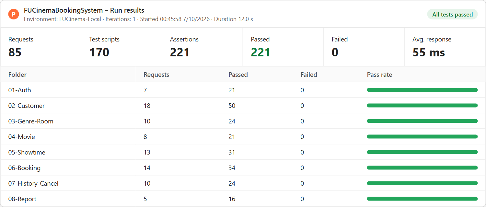

# FUCinemaBookingSystem – Assignment 01 (MSS301)

Cinema Ticket Booking System using API Gateway: 3 microservices + 1 API Gateway, mỗi service một loại database (polyglot persistence).

| Thành phần | Port | Database | Ghi chú |
|---|---|---|---|
| `customer-service` | 8081 | SQL Server 2022 – `cinema_customer` | Login (ký JWT HS256), register, profile, Admin CRUD customer – Flyway T-SQL |
| `movie-service` | 8082 | MongoDB 7 – `cinema_movie` | Genre, Room, Movie, Showtime – `DataSeeder` nạp dữ liệu mẫu |
| `booking-service` | 8083 | MySQL 8 – `cinema_booking` | Đặt vé, seat map, lịch sử, hủy, report – gọi movie-service bằng OpenFeign |
| `api-gateway` | 9000 | – | Verify JWT, phân quyền theo role, chèn `X-User-Id/Email/Role`, route |

Công nghệ: Java 21 · Spring Boot 4.1.0 · Spring Cloud 2025.1.3 · Spring Cloud Gateway Server Web MVC · Spring Data JPA / MongoDB · Flyway · OpenFeign · OAuth2 Resource Server (JWT HS256).

## Thứ tự khởi động

```bash
# 1. Database (đợi cinema-sqlserver "healthy", cinema-sqlserver-init "Exited (0)")
docker compose up -d
docker compose ps -a

# 2. Các service (mỗi lệnh một terminal)
cd customer-service && ./mvnw spring-boot:run     # :8081
cd movie-service    && ./mvnw spring-boot:run     # :8082 (tự seed lần đầu)
cd booking-service  && ./mvnw spring-boot:run     # :8083
cd api-gateway      && ./mvnw spring-boot:run     # :9000
```

Kiểm tra: `curl http://localhost:9000/actuator/health` → `{"status":"UP"}`. **Mọi request đều gọi qua cổng 9000.**

## Tài khoản test

| Vai trò | Email | Password | Ghi chú |
|---|---|---|---|
| Admin | `admin@fucinema.com` | `@@abc123@@` | Lưu trong `customer-service/application.properties` |
| Customer | `an@gmail.com` | `123456` | ID 1, ACTIVE |
| Customer | `binh@gmail.com` | `123456` | ID 2, ACTIVE |
| Customer | `chi@gmail.com` | `123456` | ID 3, INACTIVE (login → 403) |

## Kiểm thử

### Postman (F11)

- Collection: `postman/FUCinemaBookingSystem.postman_collection.json` (8 folder, 85 request, có test script)
- Environment: `postman/FUCinema-Local.postman_environment.json`
- Chạy: Postman → Run collection (environment `FUCinema-Local`, giữ thứ tự 01 → 08), hoặc CLI:

```bash
npx newman run postman/FUCinemaBookingSystem.postman_collection.json -e postman/FUCinema-Local.postman_environment.json
```

Kết quả: **85 request · 221 assertion · 0 failed**



Test thủ công 6.15 (BR14): dừng movie-service rồi đặt vé → `503 Movie service is unavailable`.

### Integration test

```bash
cd booking-service && ./mvnw test   # Testcontainers MySQL + WireMock (movie-service) – 8 test
cd api-gateway     && ./mvnw test   # MockMvc + WireMock (3 service), JWT, role, header X-User-* – 8 test
```

## Cấu trúc thư mục

```
fu-cinema/
├── docker-compose.yml   (sqlserver + sqlserver-init, mongo, mysql)
├── sqlserver/init.sql
├── mysql/init.sql
├── customer-service/
├── movie-service/
├── booking-service/
├── api-gateway/
└── postman/
```
